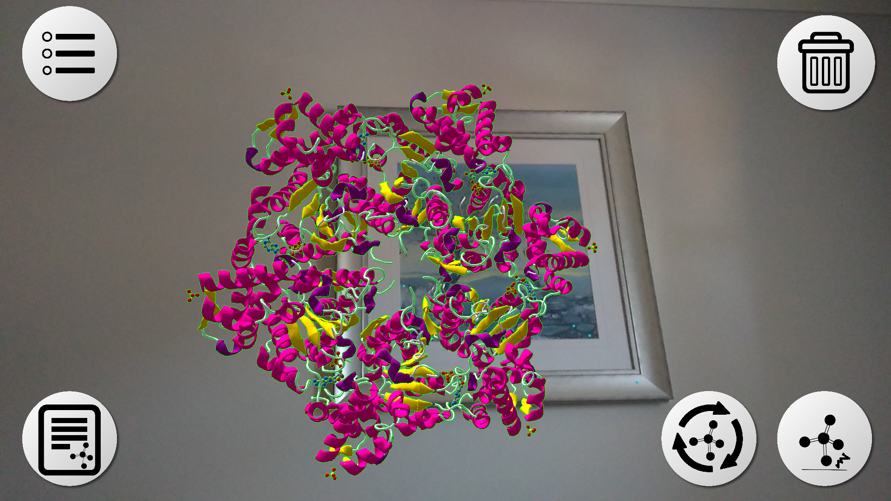
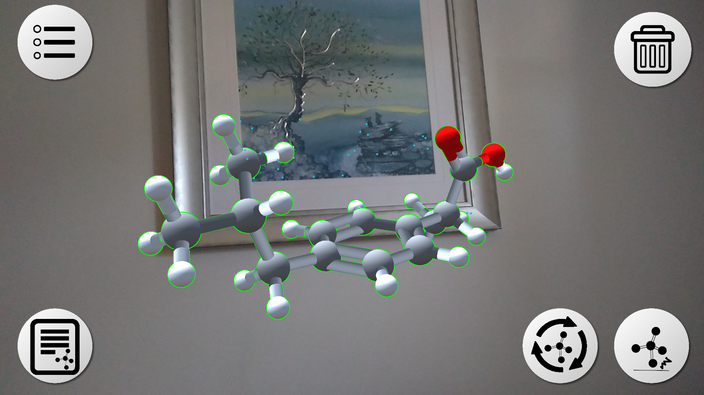
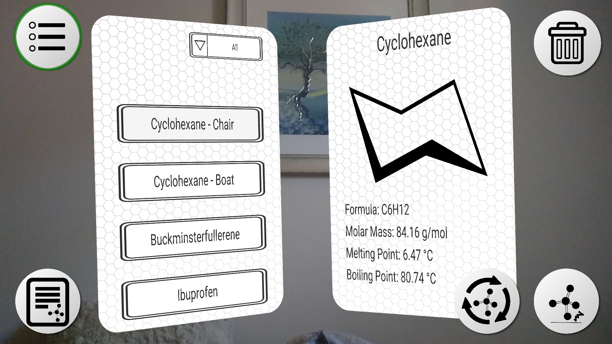

# ChemViewAR
A molecular viewer augmented reality android app. Designed using Unity and ARCore.

## Required Software
* Unity Version 2017.3.0f2 or above
* Visual Studio 2017 or any valid IDE

## Release
* ChemView AR is now available for Android on the Play Store [here](https://play.google.com/store/apps/details?id=com.Callum.ChemViewAR)

## How To Run
* Clone repo using GitHub Desktop or download as a zip file under the green 'clone' button, then extract the zip file
* Run 'ChemView Main Scene.unity' to open the main unity scene
* Build and then run the app under 'File -> Build and Run' in the Unity Editor. Following the build configuration settings [here](https://developers.google.com/ar/develop/unity/quickstart-android#build_and_run_the_sample_app)
